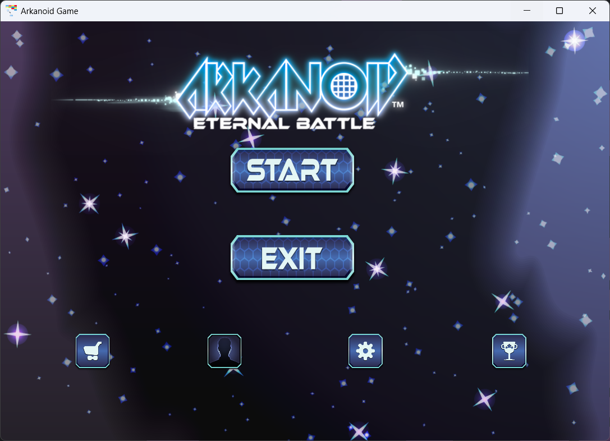
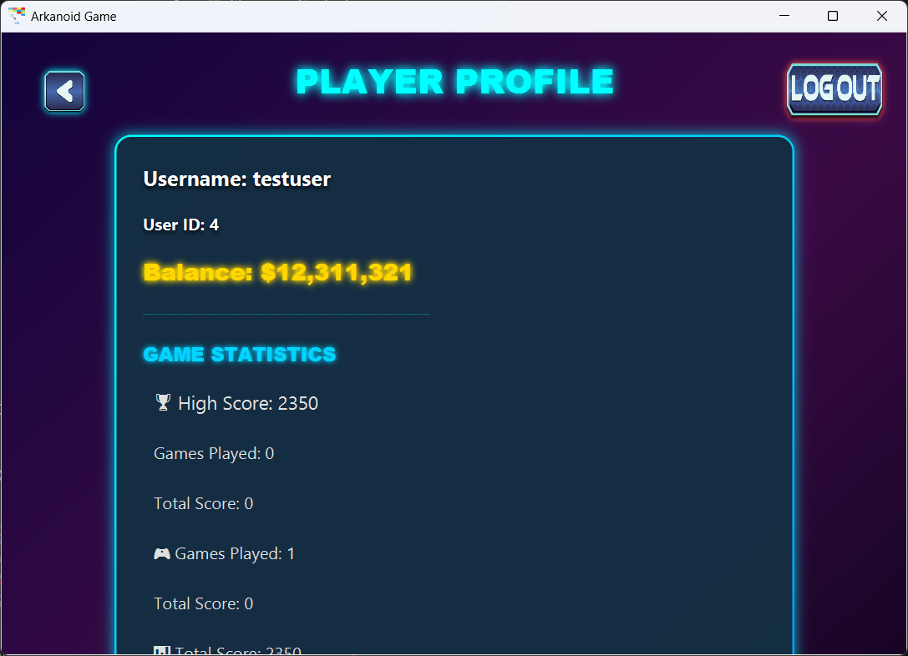
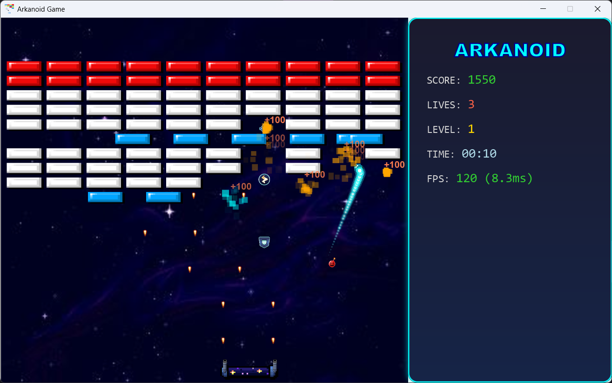
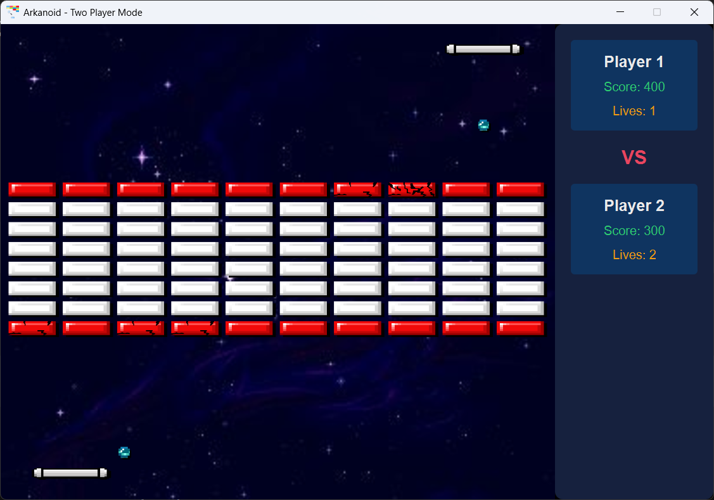
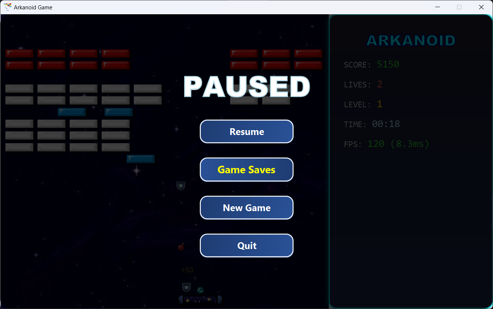
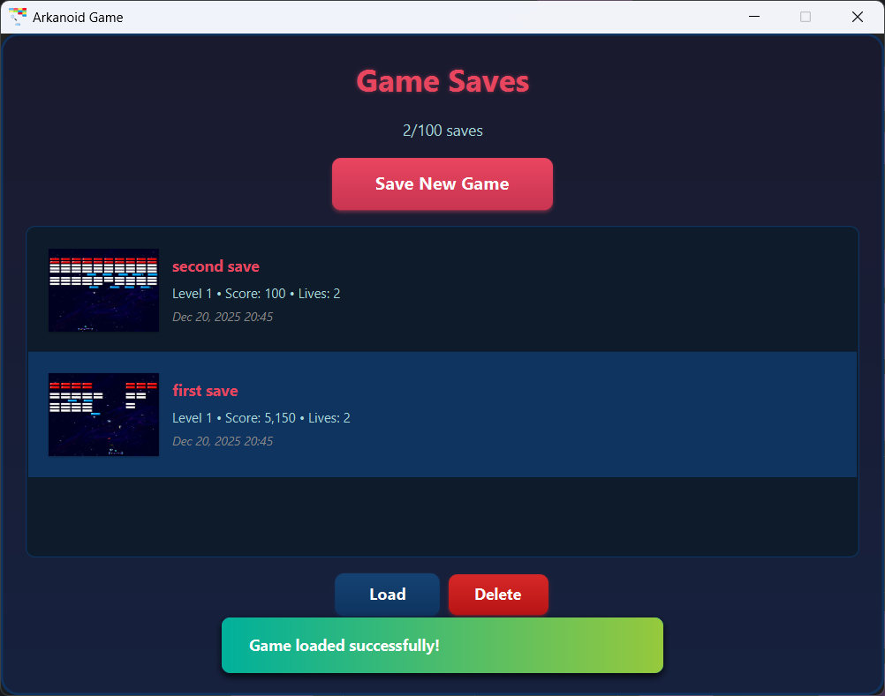
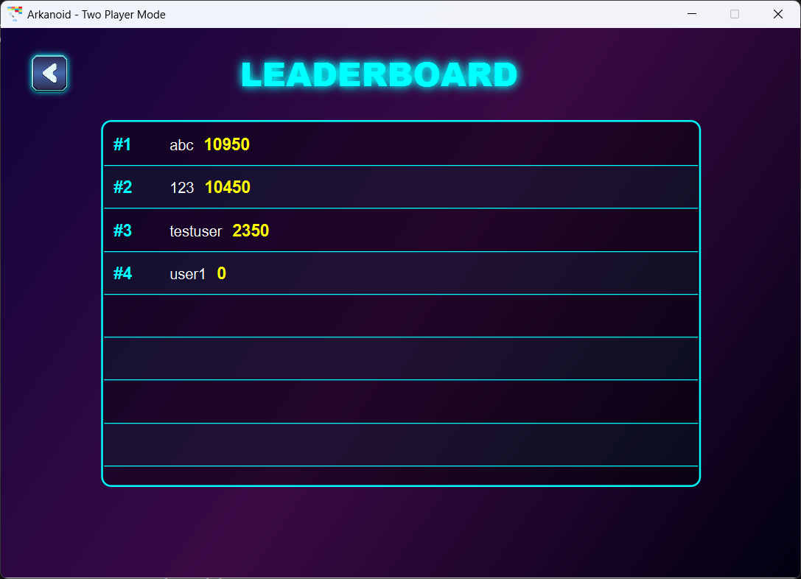

# Arkanoid Game - Object-Oriented Programming Project

<details>
<summary>Table of Contents</summary>

- [Author](#author)
- [Description](#description)
- [Demo](#demo)
  - [Game Screenshots](#game-screenshots)
- [Features](#features)
  - [Core Gameplay](#core-gameplay)
  - [Game Modes](#game-modes)
  - [Save System](#save-system)
  - [User Management](#user-management)
  - [Visual Effects](#visual-effects)
  - [Performance & Optimization](#performance--optimization)
  - [Shop & Customization](#shop--customization)
- [Game Architecture](#game-architecture)
- [Design Patterns Implementation](#design-patterns-implementation)
- [Multithreading Implementation](#multithreading-implementation)
- [Installation](#installation)
- [Usage](#usage)
  - [Controls](#controls)
  - [How to Play](#how-to-play)
  - [Power-ups](#power-ups)
- [Future Improvements](#future-improvements)
- [Main Technologies Used](#main-technologies-used)
- [License](#license)

</details>

## Author

Group 18 - Class 2526I_INT2204_6

1. Phạm Minh Khởi - 24020186
2. Trần Văn Thạo - 24020312
3. Phạm Đức Mạnh - 24020222

**Instructor**: [Kiều Văn Tuyên]  
**Semester**: [Semester 1 - 2025/2026]

---

## Description

This is a classic Arkanoid game developed in Java as a final project for Object-Oriented Programming course. The project demonstrates the implementation of OOP principles, design patterns, and modern software engineering practices.

**Key features:**

1. The game is developed using Java 21 with JavaFX for GUI.
2. Implements core OOP principles: Encapsulation, Inheritance, Polymorphism, and Abstraction.
3. Includes sound effects, animations, visual effects, and power-up systems.
4. Supports comprehensive save/load game functionality with compression and leaderboard system.
5. Two-player multiplayer mode with competitive gameplay.
6. Advanced memory management, resource optimization, and performance monitoring.

**Game mechanics:**

- Control a paddle to bounce a ball and destroy bricks
- Collect power-ups for special abilities
- Progress through multiple levels with increasing difficulty
- Score points and compete on the leaderboard
- Play with a friend in two-player mode

---

## Demo

### Game Screenshots

#### Main Menu
<div align="center">
  
  
  <p><i>Main menu interface and user profile management</i></p>
</div>

#### Gameplay
<div align="center">
  
  
  
  <p><i>Single player mode with visual effects and two-player competitive gameplay</i></p>
</div>

#### Game Features
<div align="center">
  
  
  <p><i>Save/Load system with thumbnails and game settings</i></p>
</div>

---

## Features

### Core Gameplay
- **Multiple Brick Types**: Normal bricks, strong bricks (3 hits), moving bricks, and unbreakable bricks
- **Power-Up System**: Expand paddle, thunder strike, gun paddle, explosion ball, and row clear
- **Score System**: Floating text displays score on brick destruction
- **Progressive Difficulty**: Multiple levels with increasing complexity
- **Physics Engine**: Realistic ball physics and collision detection

### Game Modes
- **Single Player**: Classic Arkanoid gameplay with multiple levels
- **Two Player Mode**: Competitive multiplayer with:
  - Dual player stats panel tracking scores and lives
  - Special multiplayer level configuration
  - Collision service handling inter-player interactions
  - Power-up interference system
  - Respawn mechanics with invincibility periods

### Save System
- **Game State Persistence**: Save and load game progress at any time
- **LZ4 Compression**: Efficient storage with compression for save files
- **Thumbnail Capture**: Visual preview of saved games
- **Multiple Save Slots**: Manage multiple game saves
- **Asynchronous I/O**: Non-blocking save/load operations
- **Session Storage**: Automatic session persistence with compression

### User Management
- **Authentication System**: Secure sign-up and sign-in with password hashing
- **User Profiles**: Track player statistics and achievements
- **User Preferences**: Customizable settings and preferences
- **Inventory System**: Manage purchased items and customizations
- **Leaderboard**: Global high score tracking

### Visual Effects
- **Trail Effects**: Dynamic ball and paddle trails for enhanced visuals
- **Floating Text**: Score popups when destroying bricks
- **Line Effects**: Visual feedback for special actions
- **Particle System**: Explosion and impact effects
- **Object Pooling**: Efficient reuse of visual effect objects for performance

### Performance & Optimization
- **Memory Monitor**: Real-time heap usage tracking and memory profiling
- **ColorCache Utility**: Efficient color object management to reduce GC pressure
- **Resource Management**: Proper cleanup and memory leak prevention
- **Asset Preloading**: Preload images and sounds for smooth gameplay
- **Optimized Rendering**: Enhanced rendering pipeline for brick textures and effects
- **Logging System**: Comprehensive logging with Logback (stdout/stderr redirection)

### Shop & Customization
- **Ball Skins**: Purchase and equip different ball appearances
- **Paddle Skins**: Customize paddle visuals
- **Toast Notifications**: User feedback for purchases and actions
- **Currency System**: Earn and spend in-game currency

---

## Game Architecture

The game follows a modular architecture based on the **Entity-Component-System (ECS)** pattern with clear separation of concerns:

### Core Architecture Layers

1. **Presentation Layer** (`com.arkanoid.ui`)
   - Scene management and view controllers
   - JavaFX UI components and screens
   - User interaction handling

2. **Business Logic Layer** (`com.arkanoid.systems`)
   - **GameManager**: Central game state coordinator
   - **LevelManager**: Level loading and progression
   - **ThreadManager**: Manages game loop and async operations
   - **TwoPlayerMatchManager**: Multiplayer game coordination
   - **Save System**: Game state serialization and persistence

3. **Entity Layer** (`com.arkanoid.core.entities`)
   - Game objects: Ball, Paddle, Bricks, PowerUps
   - Visual effects: TrailEffect, FloatingText, LineEffect
   - Entity behaviors and rendering

4. **Physics Layer** (`com.arkanoid.core.physics`)
   - Collision detection and resolution
   - Physics engine for realistic movement
   - Boundary checking

5. **Data Layer** (`com.arkanoid.database`)
   - Repository pattern for data access
   - Database management (SQLite)
   - Entity managers: UserManager, PlayerProfileManager, InventoryManager

6. **Utilities & Services**
   - **SoundManager**: Audio playback and management
   - **LoggingManager**: Centralized logging system
   - **MemoryMonitor**: Performance and memory tracking
   - **ColorCache**: Object pooling for performance
   - **CompressionUtil**: LZ4 compression for data storage

### Key Architectural Patterns

- **Singleton**: GameManager, SoundManager, DatabaseManager
- **Factory**: EntityFactory for creating game objects
- **Repository**: Data access abstraction layer

<div align="center">
  
   <p><i>Architecture diagram of the Arkanoid game</i></p>
</div>
> **Note**: Detailed architecture diagrams are available in [docs/uml/](docs/uml/):
> - `architecture.png` - Rendered PNG of the architecture diagram
> - `architecture.puml` - PlantUML class diagram source
> - `architecture.md` - Mermaid-compatible class diagram

---

## Design Patterns Implementation

### 1. Singleton Pattern

**Used in:** `GameManager`, `SoundManager`, `DatabaseManager`

**Purpose:** Ensure only one instance exists throughout the application for centralized state management.

### 2. Factory Pattern

**Used in:** `EntityFactory`, `RepositoryFactory`

**Purpose:** Create game entities (Ball, PowerUp) and repositories without exposing instantiation logic.

### 3. Repository Pattern

**Used in:** `UserRepository`, `PlayerProfileRepository`, `GameSaveRepository`

**Purpose:** Abstract data access layer providing clean separation between business logic and data persistence.

---

## Multithreading Implementation

The game uses multiple threads to ensure smooth performance and responsive UI:

1. **Game Loop Thread**: Updates game logic at 60 FPS with frame-rate independent timing
2. **Rendering Thread**: JavaFX Application Thread handles graphics rendering
3. **Audio Thread Pool**: Plays sound effects asynchronously without blocking gameplay
4. **I/O Thread Pool**: Handles save/load operations, asset preloading, and database queries without blocking UI
5. **Memory Monitor Thread**: Tracks heap usage and memory statistics in background

**Thread Safety:**
- Thread-safe collections for concurrent access
- Proper synchronization for shared state
- ThreadContext for managing thread-local state
- Executor service management via ThreadManager

---

## Installation

1. Clone the project from the repository.
2. Open the project in any IDEs that supports Java and Gradle.
3. Run the project from prebuilt the run task or manually trigger build on CLI using gradle wrapper.
   ```bash
   ./gradlew run
   ```

## Usage

### Controls

#### Single Player Mode
| Key     | Action            |
| ------- | ----------------- |
| `←`     | Move paddle left  |
| `→`     | Move paddle right |
| `SPACE` | Launch ball       |
| `ESC`   | Pause game        |

#### Two Player Mode
**Player 1:**
| Key     | Action            |
| ------- | ----------------- |
| `A`     | Move paddle left  |
| `D`     | Move paddle right |
| `SPACE` | Launch ball       |

**Player 2:**
| Key     | Action            |
| ------- | ----------------- |
| `←`     | Move paddle left  |
| `→`     | Move paddle right |
| `ENTER` | Launch ball       |

**Both Players:**
| Key     | Action            |
| ------- | ----------------- |
| `ESC`   | Pause game        |

### How to Play

1. **Start the game**: Click "New Game" from the main menu or "Two Player" for multiplayer.
2. **Control the paddle**: Use arrow keys (or A/D for Player 1 in multiplayer) to move left and right.
3. **Launch the ball**: Press SPACE (or ENTER for Player 2) to launch the ball from the paddle.
4. **Destroy bricks**: Bounce the ball to hit and destroy bricks.
5. **Collect power-ups**: Catch falling power-ups for special abilities.
6. **Avoid losing the ball**: Keep the ball from falling below the paddle.
7. **Complete the level**: Destroy all destructible bricks to advance.
8. **Save your progress**: Press ESC to pause and save your game at any time.

### Power-ups

| Icon | Name           | Effect                                        |
| ---- | -------------- | --------------------------------------------- |
| 🟦   | Expand Paddle  | Increases paddle width for easier ball catch  |
| ⚡   | Thunder        | Lightning bolt destroys multiple bricks       |
| 🔫   | Gun            | Shoot lasers to destroy bricks                |
| 💥   | Explosion Ball | Ball causes explosion on brick impact         |
| 🧹   | Row Clear      | Clears an entire row of bricks                |

### Brick Types

- **Normal Brick**: Breaks after one hit - standard score points.
- **Strong Brick**: Requires three hits to destroy - higher score value.
- **Moving Brick**: Moves horizontally - challenging to hit.
- **Unbreakable Brick**: Cannot be destroyed by normal means - requires special power-ups.

---

## Future Improvements

### Planned Features

1. **Additional game modes**

   - Time attack mode with countdown timer
   - Survival mode with endless levels
   - Challenge mode with special objectives

2. **Enhanced gameplay**

   - Boss battles at end of worlds
   - More power-up varieties (freeze time, shield wall, multi-ball)
   - Achievements and badges system
   - Daily challenges and rewards

3. **Technical improvements**

   - Network multiplayer with online matchmaking
   - Advanced particle effects and shaders
   - Implement AI opponent mode
   - Cloud save synchronization
   - Mobile platform support (Android/iOS)
   - Replay system with video recording

4. **Content expansion**
   - Level editor for custom levels
   - Community level sharing
   - More customization options (themes, soundtracks)
   - Seasonal events and limited-time content

---

## Main Technologies Used

| Technology         | Version | Purpose                          |
| ------------------ | ------- | -------------------------------- |
| Java               |   21    | Core language                    |
| JavaFX             | 21.0.9  | GUI framework                    |
| Gradle             | 9.1.0   | Build tool & dependency manager  |
| SQLite (via JDBC)  | Latest  | Local database storage           |
| LZ4 Compression    | 1.8.0   | Data compression for saves       |
| Logback            | 1.5.12  | Logging framework                |
| GSON               | 2.13.2  | JSON parsing                     |
| JUnit              | 5.11.3  | Unit testing framework           |

---

## License

This project is licensed under the MIT License and developed for educational purposes only.
