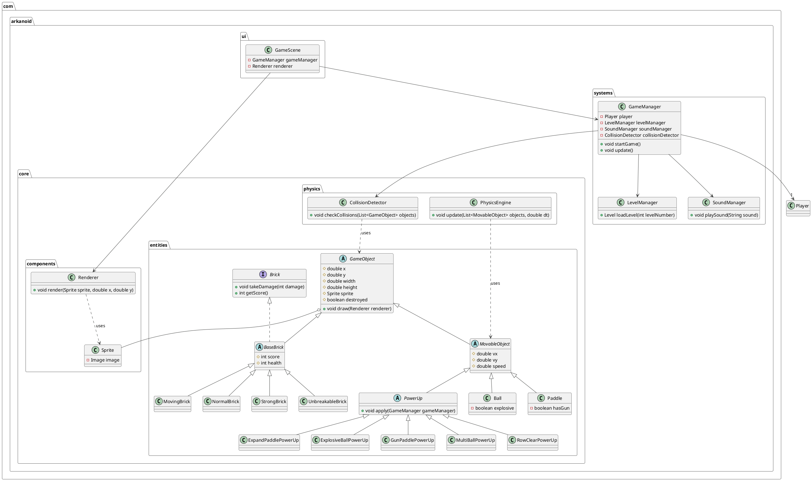

# Arkanoid Game Clone

A modern implementation of the classic arcade game Arkanoid, built with Java and JavaFX. This project is managed with Gradle and features multiple levels, power-ups, a scoring system, and player profiles persisted via SQLite.

## Features

- **Classic Gameplay**: Control a paddle to bounce a ball and destroy bricks.
- **Multiple Levels**: Levels are defined in JSON files for easy modification and expansion.
- **Power-Ups**: Includes various power-ups like paddle expansion, guns, and multi-ball.
- **Scoring and Lives**: Track your score and manage a limited number of lives.
- **Player Profiles**: Uses an SQLite database to save player progress and scores.
- **UI**: A clean user interface built with JavaFX and FXML.

## Tech Stack

- **Language**: Java 21
- **Framework**: JavaFX
- **Build Tool**: Gradle
- **Dependencies**:
  - **Gson**: For parsing level data from JSON files.
  - **SQLite-JDBC**: For database connectivity.
  - **JUnit 5**: For unit testing.

## Architecture Overview

The project is structured into several packages, separating core game logic, UI, and data persistence. The following diagram illustrates the high-level class structure.



## Getting Started

### Prerequisites

- Java Development Kit (JDK) 21 or later.

### Building the Project

To build the project and install all dependencies, run the following command in the project's root directory:

```bash
./gradlew build
```

### Running the Game

To run the game, use the following Gradle command:

```bash
./gradlew run
```

### Running Tests

To run the unit tests, execute:

```bash
./gradlew test
```

## Author

- **[Placeholder Name]**

@startuml
!theme vibrant

package "com.arkanoid.core.entities" {
abstract class GameObject { # double x # double y # double width # double height # Sprite sprite # boolean destroyed + void draw(Renderer renderer)
}

    abstract class MovableObject extends GameObject {
        # double vx
        # double vy
        # double speed
    }

    class Ball extends MovableObject {
        - boolean explosive
    }

    class Paddle extends MovableObject {
        - boolean hasGun
    }

    interface Brick {
        + void takeDamage(int damage)
        + int getScore()
    }

    abstract class BaseBrick extends GameObject implements Brick {
        # int score
        # int health
    }

    class NormalBrick extends BaseBrick
    class StrongBrick extends BaseBrick
    class UnbreakableBrick extends BaseBrick
    class MovingBrick extends BaseBrick

    abstract class PowerUp extends MovableObject {
        + void apply(GameManager gameManager)
    }

    class ExpandPaddlePowerUp extends PowerUp
    class ExplosiveBallPowerUp extends PowerUp
    class GunPaddlePowerUp extends PowerUp
    class MultiBallPowerUp extends PowerUp
    class RowClearPowerUp extends PowerUp

}

package "com.arkanoid.systems" {
class GameManager { - Player player - LevelManager levelManager - SoundManager soundManager - CollisionDetector collisionDetector + void startGame() + void update()
}

    class LevelManager {
        + Level loadLevel(int levelNumber)
    }

    class SoundManager {
        + void playSound(String sound)
    }

}

package "com.arkanoid.core.physics" {
class CollisionDetector { + void checkCollisions(List<GameObject> objects)
}

    class PhysicsEngine {
        + void update(List<MovableObject> objects, double dt)
    }

}

package "com.arkanoid.ui" {
class GameScene { - GameManager gameManager - Renderer renderer
}
}

package "com.arkanoid.core.components" {
class Renderer { + void render(Sprite sprite, double x, double y)
}
class Sprite { - Image image
}
}

GameManager --> LevelManager
GameManager --> SoundManager
GameManager --> CollisionDetector
GameManager --> "1" Player
GameScene --> GameManager
GameScene --> Renderer

GameObject o-- Sprite
CollisionDetector ..> GameObject : uses
PhysicsEngine ..> MovableObject : uses
Renderer ..> Sprite : uses

@enduml

@startuml
!theme vibrant

package "com.arkanoid.core.entities" {
abstract class GameObject { # double x # double y # double width # double height # Sprite sprite # boolean destroyed + void draw(Renderer renderer)
}

    abstract class MovableObject extends GameObject {
        # double vx
        # double vy
        # double speed
    }

    class Ball extends MovableObject {
        - boolean explosive
    }

    class Paddle extends MovableObject {
        - boolean hasGun
    }

    interface Brick {
        + void takeDamage(int damage)
        + int getScore()
    }

    abstract class BaseBrick extends GameObject implements Brick {
        # int score
        # int health
    }

    class NormalBrick extends BaseBrick
    class StrongBrick extends BaseBrick
    class UnbreakableBrick extends BaseBrick
    class MovingBrick extends BaseBrick

    abstract class PowerUp extends MovableObject {
        + void apply(GameManager gameManager)
    }

    class ExpandPaddlePowerUp extends PowerUp
    class ExplosiveBallPowerUp extends PowerUp
    class GunPaddlePowerUp extends PowerUp
    class MultiBallPowerUp extends PowerUp
    class RowClearPowerUp extends PowerUp

}

package "com.arkanoid.systems" {
class GameManager { - Player player - LevelManager levelManager - SoundManager soundManager - CollisionDetector collisionDetector + void startGame() + void update()
}

    class LevelManager {
        + Level loadLevel(int levelNumber)
    }

    class SoundManager {
        + void playSound(String sound)
    }

}

package "com.arkanoid.core.physics" {
class CollisionDetector { + void checkCollisions(List<GameObject> objects)
}

    class PhysicsEngine {
        + void update(List<MovableObject> objects, double dt)
    }

}

package "com.arkanoid.ui" {
class GameScene { - GameManager gameManager - Renderer renderer
}
}

package "com.arkanoid.core.components" {
class Renderer { + void render(Sprite sprite, double x, double y)
}
class Sprite { - Image image
}
}

GameManager --> LevelManager
GameManager --> SoundManager
GameManager --> CollisionDetector
GameManager --> "1" Player
GameScene --> GameManager
GameScene --> Renderer

GameObject o-- Sprite
CollisionDetector ..> GameObject : uses
PhysicsEngine ..> MovableObject : uses
Renderer ..> Sprite : uses

@enduml

@startuml
!theme vibrant

package "com.arkanoid.core.entities" {
abstract class GameObject { # double x # double y # double width # double height # Sprite sprite # boolean destroyed + void draw(Renderer renderer)
}

    abstract class MovableObject extends GameObject {
        # double vx
        # double vy
        # double speed
    }

    class Ball extends MovableObject {
        - boolean explosive
    }

    class Paddle extends MovableObject {
        - boolean hasGun
    }

    interface Brick {
        + void takeDamage(int damage)
        + int getScore()
    }

    abstract class BaseBrick extends GameObject implements Brick {
        # int score
        # int health
    }

    class NormalBrick extends BaseBrick
    class StrongBrick extends BaseBrick
    class UnbreakableBrick extends BaseBrick
    class MovingBrick extends BaseBrick

    abstract class PowerUp extends MovableObject {
        + void apply(GameManager gameManager)
    }

    class ExpandPaddlePowerUp extends PowerUp
    class ExplosiveBallPowerUp extends PowerUp
    class GunPaddlePowerUp extends PowerUp
    class MultiBallPowerUp extends PowerUp
    class RowClearPowerUp extends PowerUp

}

package "com.arkanoid.systems" {
class GameManager { - Player player - LevelManager levelManager - SoundManager soundManager - CollisionDetector collisionDetector + void startGame() + void update()
}

    class LevelManager {
        + Level loadLevel(int levelNumber)
    }

    class SoundManager {
        + void playSound(String sound)
    }

}

package "com.arkanoid.core.physics" {
class CollisionDetector { + void checkCollisions(List<GameObject> objects)
}

    class PhysicsEngine {
        + void update(List<MovableObject> objects, double dt)
    }

}

package "com.arkanoid.ui" {
class GameScene { - GameManager gameManager - Renderer renderer
}
}

package "com.arkanoid.core.components" {
class Renderer { + void render(Sprite sprite, double x, double y)
}
class Sprite { - Image image
}
}

GameManager --> LevelManager
GameManager --> SoundManager
GameManager --> CollisionDetector
GameManager --> "1" Player
GameScene --> GameManager
GameScene --> Renderer

GameObject o-- Sprite
CollisionDetector ..> GameObject : uses
PhysicsEngine ..> MovableObject : uses
Renderer ..> Sprite : uses

@enduml
