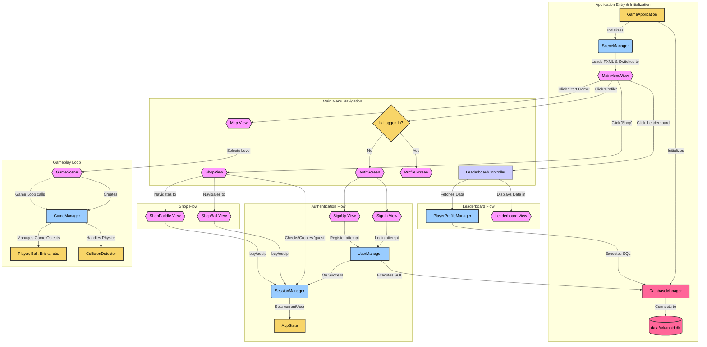

# Arkanoid Game Project Workflow

This document outlines the major workflows and class interactions within the Arkanoid game project, visualized using a Mermaid chart.

```mermaid
graph TD
    subgraph "Application Entry & Initialization"
        A[GameApplication] -->|Initializes| B(SceneManager)
        A -->|Initializes| D[DatabaseManager]
        D -->|Connects to| E[(data/arkanoid.db)]
        B -->|Loads FXML & Switches to| C{{MainMenuView}}
    end

    subgraph "Main Menu Navigation"
        C -->|Click 'Start Game'| F{{Map View}}
        C -->|Click 'Shop'| G{{ShopView}}
        C -->|Click 'Leaderboard'| H[LeaderboardController]
        C -->|Click 'Profile'| I{Is Logged In?}
        I -- Yes --> J{{ProfileScreen}}
        I -- No --> K{{AuthScreen}}
    end

    subgraph "Authentication Flow"
        K --> L{{SignIn View}} & M{{SignUp View}}
        L -->|Login attempt| N[UserManager]
        M -->|Register attempt| N[UserManager]
        N -->|Executes SQL| D
        N -->|On Success| P(SessionManager)
        P -->|Sets currentUser| AppState
    end

    subgraph "Gameplay Loop"
        F -->|Selects Level| Q{{GameScene}}
        Q -->|Creates| R[GameManager]
        R -->|Manages Game Objects| S[Player, Ball, Bricks, etc.]
        R -->|Handles Physics| T[CollisionDetector]
        Q -.->|Game Loop calls| R
    end

    subgraph "Shop Flow"
        G -->|Checks/Creates 'guest'| P
        G -->|Navigates to| U{{ShopBall View}} & V{{ShopPaddle View}}
        U -->|buy/equip| P
        V -->|buy/equip| P
    end

    subgraph "Leaderboard Flow"
        H -->|Fetches Data| W[PlayerProfileManager]
        W -->|Executes SQL| D
        H -->|Displays Data in| X{{Leaderboard View}}
    end

    %% Style Definitions
    classDef ui fill:#f9f,stroke:#333,stroke-width:2px,color:#000;
    classDef controller fill:#ccf,stroke:#333,stroke-width:2px,color:#000;
    classDef manager fill:#9cf,stroke:#333,stroke-width:2px,color:#000;
    classDef db fill:#f69,stroke:#333,stroke-width:2px,color:#000;
    classDef logic fill:#f8d568,stroke:#333,stroke-width:2px,color:#000;

    class C,F,G,J,K,L,M,Q,U,V,X ui;
    class H controller;
    class B,N,R,P,W manager;
    class D,E db;
    class A,S,T,I,AppState logic;
```
